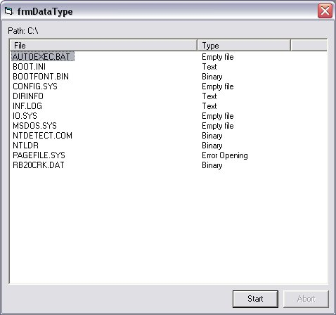



## Updated\! Determine if a file is binary or text

### Description

Compares a file's contents to a predefined byte-table. If a match is found, the file is classified as binary.

I've extracted the byte-table from over 4500 different textfiles in both ANSI and ASCII standard (well over 200 Mb.) The bytes in the table do not occur in any of the following filetypes: .BAT, .TXT, .HTM, .INI, .JS, .BAS, .INC, .LOG, .VBP, etc.

Because of this it's pretty plausible to state that if a file should contain any of the bytes in the table, it MUST be binary. I do not expect this routine to be 100% accurate but for the purpose of deciding whether to open a file in a text-editor or a hex-editor this will do just fine.

please keep in mind that the original byte-table is a bit larger (mail me to get a list) but comparing the rest as well does not provide more accuracy and will lead to false interpretation of localized files.
 
### More Info
 

             |
---                |---
**Submitted On**   |2004-09-28 05:22:02
**By**             |[NeBaGeMo](https://github.com/Planet-Source-Code/PSCIndex/blob/master/ByAuthor/nebagemo.md)
**Level**          |Intermediate
**User Rating**    |4.7 (14 globes from 3 users)
**Compatibility**  |VB 6\.0
**Category**       |[Files/ File Controls/ Input/ Output](https://github.com/Planet-Source-Code/PSCIndex/blob/master/ByCategory/files-file-controls-input-output__1-3.md)
**World**          |[Visual Basic](https://github.com/Planet-Source-Code/PSCIndex/blob/master/ByWorld/visual-basic.md)
**Archive File**   |[Updated\!\_D1798309282004\.zip](https://github.com/Planet-Source-Code/nebagemo-updated-determine-if-a-file-is-binary-or-text__1-56349/archive/master.zip)

